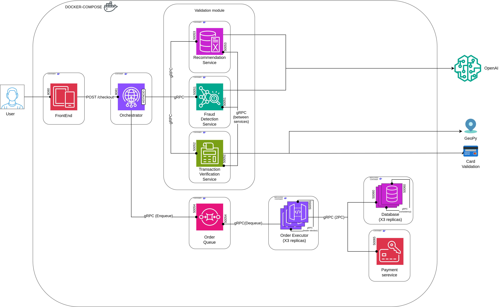
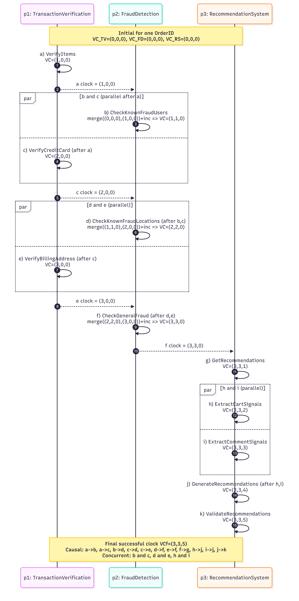
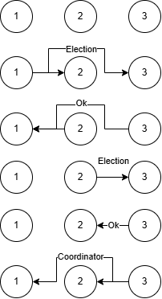
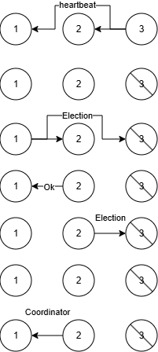
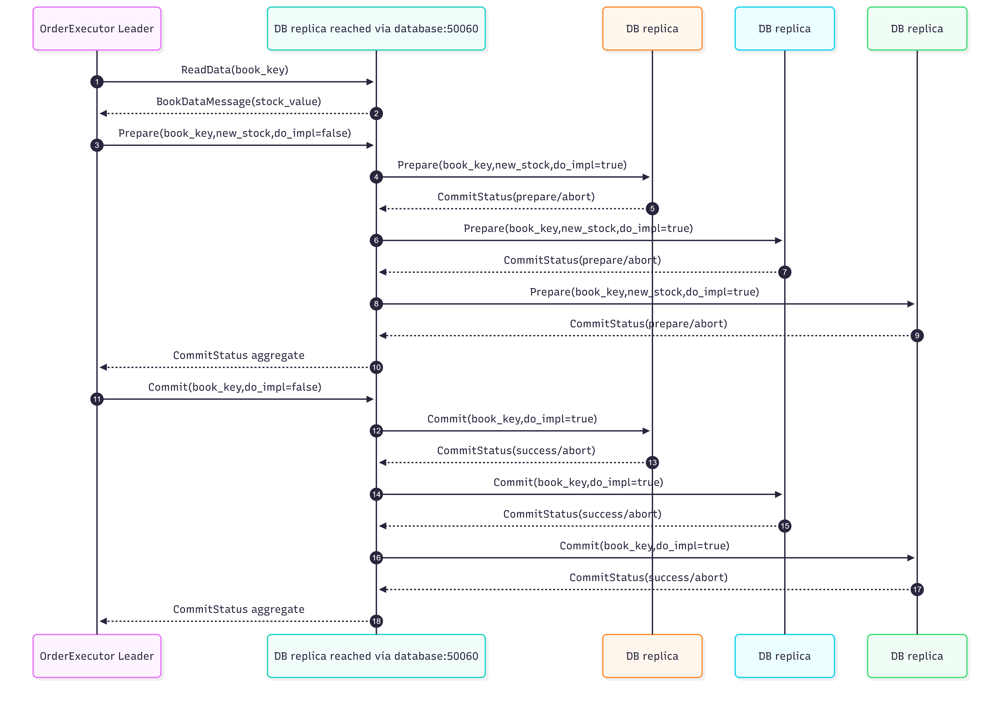
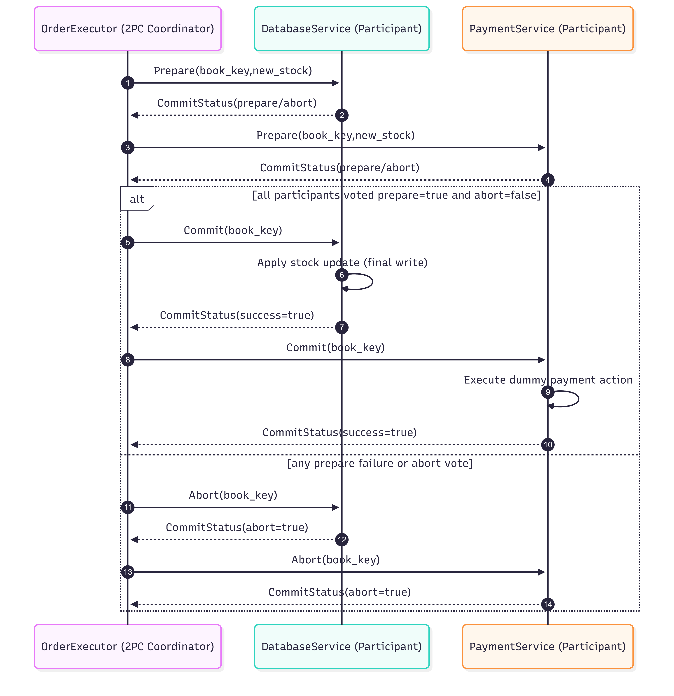
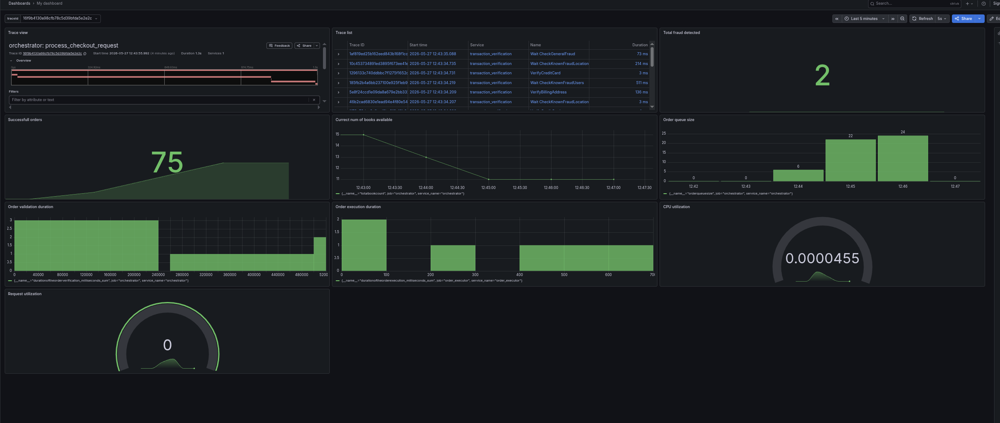

# Distributed Systems Project - Bookstore

**Team:** Yevhen Pankevych, Yehor Bachynsky, Merili Pihlak

This repository contains the code for the practice sessions of the Distributed Systems course at the University of Tartu.

## Checkpoint 1

### Overview

An online bookstore system composed of multiple microservices that communicate via **gRPC**, and have a general orchestrator with the REST API provided. When a user places an order through the frontend, the orchestrator concurrently invokes all backend services and returns a combined response.

### Architecture



### Services

| Service | Description | Port |
| --- | --- | --- |
| **Frontend** | Static HTML page, running in a Docker container, with the exposed port | REST `8080` |
| **Orchestrator** | Flask REST API to do checkout; orchestrates calls to all services via async gRPC | REST `8081` |
| **Fraud Detection** | Uses OpenAI to detect fraud orders (prompt injection, suspicious fields, etc.) | gRPC `50051` |
| **Transaction Verification** | Validates credit card number (Luhn's algorithm), card vendor (Visa/Mastercard), expiry date, billing address (validates address is real using GeoPy), and item list (items are not empty and do not exceed reasonable quantities) | gRPC `50052` |
| **Recommendation System** | Uses OpenAI to suggest books from the catalog based on the user's order | gRPC `50053` |

### gRPC Interfaces

Each service returns a response with the direct answer (is_fraud, is_valid, recommendations) and an optional error message if something went wrong. The orchestrator combines the responses and returns a single JSON object to the frontend.

Methods:
- `FraudDetectionService.CheckFraud(FraudRequest(user, credit_card, user_comment, List(item), billing_address, shipping_method, gift_wrapping, terms_accepted))` -> `FraudResponse(is_fraud, error_message)`
- `TransactionVerificationService.VerifyTransaction(TransactionVerificationRequest(credit_card, List(item), billing_address))` -> `TransactionVerficationResponse(is_valid, error_message)`
- `RecommendationService.GetRecommendations(RecommendationRequest(user_comment, List(item)), top_k))` -> `RecommendationResponse(suggested_books, error_message)`


## Checkpoint 2

### Vector Clock Diagram



### Leader Election Diagram



### System Model

The system follows a **microservice architecture with centralized entry point + chained backend execution**. The orchestrator receives checkout requests and initializes/cleans service state, while most validation events are executed through service-to-service calls. Order execution is decoupled through an order queue and replicated executors.

#### Architecture Type

- Orchestrated microservices with partial-order event flow and intra-service threading.
- Hybrid communication model: synchronous gRPC for validation path, asynchronous queue/executor path for order execution.
- Vector-clock-based causal tracking across transaction-verification, fraud-detection, and recommendation services (3-component clocks).

#### Service Roles

- **Frontend**: sends checkout requests over HTTP.
- **Orchestrator**: entry point, generates unique `OrderID`, initializes services, triggers validation flow, clears transactions, enqueues approved orders.
- **Transaction Verification**: validates items, credit card format/vendor/expiry/CVV, and billing address.
- **Fraud Detection**: checks known fraud signals and runs AI-based fraud analysis.
- **Recommendation System**: generates recommendations with AI and deterministic fallback.
- **Order Queue**: provides `Enqueue`/`Dequeue` queueing operations.
- **Order Executor replicas**: run leader election; only leader dequeues and executes queued orders.

#### Connections Between Services

- `frontend -> orchestrator` over REST (`/checkout`).
- `orchestrator -> transaction_verification`, `fraud_detection`, `recommendation_system` over gRPC for `InitTransaction` and `ClearTransaction`.
- `orchestrator -> transaction_verification` over gRPC (`VerifyItems`) to start the validation/event chain.
- `transaction_verification -> fraud_detection` over gRPC (`CheckKnownFraudUsers`, `CheckKnownFraudLocations`, `CheckGeneralFraud`).
- `fraud_detection -> recommendation_system` over gRPC (`GetRecommendations`) when fraud checks pass.
- `orchestrator -> order_queue` over gRPC (`Enqueue`) after successful validation flow.
- `order_executor leader -> order_queue` over gRPC (`Dequeue`).
- `order_executor replicas <-> each other` over gRPC (`Election`, `Coordinator`, `Heartbeat`).

#### Event Ordering and Vector Clocks

- For each new `OrderID`, transaction-verification, fraud-detection, and recommendation-system initialize local cached order state and local vector clock `(0,0,0)`.
- Each event updates vector clock with the rule: component-wise `max(local, incoming)`, then increments own service index.
- Validation flow is partially ordered with concurrency:
  - In transaction verification, local checks run in parallel with remote fraud events using threads.
  - In recommendation system, `ExtractCartSignals` and `ExtractCommentSignals` run in parallel, then join into generation/validation.
- In current flow, fraud events receive TV clocks, so early FD clocks are expected to look like `(1,1,0)` then `(2,2,0)` rather than `(0,1,0)` and `(0,2,0)`.
- The orchestrator uses the returned status clock as the final clock for cleanup broadcast (`ClearTransaction`).

#### Failure Modes and Handling

- **Validation failure**: any failed intermediate event is propagated immediately to orchestrator, order is denied.
- **Service/RPC timeout or unavailability**: treated as failed event in request flow.
- **AI failure**:
  - Fraud detection is fail-closed in current behavior (can deny order).
  - Recommendation system falls back to deterministic recommendations when AI is unavailable.
- **Leader failure (executors)**: heartbeat timeout triggers bully-election rerun.
- **Queue empty**: non-fatal; leader keeps polling.
- **State durability limitation**: order cache/vector-clock state is in memory; service restart can lose transient per-order state.
- **Clear consistency nuance**: strict vector-clock compatibility check on clear is implemented in recommendation service; other services clear by order id.

#### Consistency and Trade-offs

- Vector clocks provide explicit causal ordering and concurrency visibility between service events.
- Queue + leader executor ensures mutual exclusion for dequeue/execution in normal operation.
- Without persistent storage/retry semantics, processing guarantees are practical but not fully fault-tolerant in crash scenarios.

## Checkpoint #3: Evaluation and Protocol Analysis

### Implementation description

- A new gRPC `DatabaseService` was added with `ReadData`, `Prepare`, `Commit`, and `Abort` operations.
- The database service is configured with 3 replicas in `docker-compose.yaml` (`deploy.replicas: 3`).
- The database module implements a primary-like per-request coordination pattern: the replica that receives the external DB request fans out `Prepare/Commit/Abort` to the `database` service replicas discovered via DNS.
- The `order_executor` leader dequeues approved orders, reads current stock (`ReadData`), computes new stock, and triggers the write path.
- A new dummy `PaymentService` was added as a commit participant (`Prepare/Commit/Abort`).
- The distributed commitment protocol is Two-Phase Commit (2PC) coordinated by the executor.
- If the coordinator decides `Commit`, the database applies the stock update and payment executes its final operation; if it decides `Abort`, participants keep no final side effects.

### Consistency protocol diagram




- The diagram shows executor requests reaching the database layer and write coordination across DB replicas.
- The executor performs reads through the database gRPC endpoint (`ReadData`), then initiates write-related prepare/commit steps.
- Writes are handled as `Prepare -> Commit/Abort`, with the contacted DB replica forwarding internal replication requests to other DB instances.
- Consistency is maintained by delaying final DB state change until commit and by propagating commit decisions across replicas.
- Trade-offs: stronger write ordering in normal operation, but higher write latency, coordinator dependency, and limited fault tolerance under failures.

### Distributed commitment protocol diagram




- The executor acts as the 2PC coordinator; `DatabaseService` and `PaymentService` are participants.
- In the prepare/vote phase, executor sends `Prepare` to both participants and collects their statuses.
- If all votes are positive, executor sends `Commit`; otherwise, it sends `Abort`.
- The database stock update is applied only during `Commit`, not during `Prepare`.
- The payment operation is executed only during `Commit`; on `Abort`, prepared state is discarded and no final payment/update is applied.

### Limitations

- 2PC has blocking risk if the coordinator fails after participants prepare.
- The coordinator role is centralized in the current leader executor instance.
- Database/payment prepared state is in-memory, so crash recovery is limited.

### Bonus 3: Coordinator Failure During the Commitment Protocol

**Context.** In the current implementation, the leader `order_executor` is the **2PC coordinator**, while `DatabaseService` and `PaymentService` are **participants**. The coordinator starts `_two_phase_commit`, sends `Prepare`, collects votes, and broadcasts the final `Commit` or `Abort`.

#### Failure scenarios and consequences

1. **Coordinator fails before `Prepare`**
- No participant has entered prepared state.
- No final side effects are applied.
- The order can be retried safely.

2. **Coordinator fails after `Prepare`, before final decision**
- Participants may have voted YES and moved to prepared state.
- In standard 2PC, participants cannot safely decide alone.
- Transaction may block until coordinator recovers.

3. **Coordinator fails after sending `Commit` to only some participants**
- One participant may finalize while another remains prepared.
- Temporary inconsistency can occur.
- Example: payment committed while stock update is still pending, or vice versa.

#### Practical impact on this system

- Orders can remain in uncertain or partially completed state.
- Prepared records can remain pending and reduce throughput.
- Availability drops while participants wait for final decision.
- Recovery progress depends on coordinator restoration path.

#### Proposed solution 

1. **Durable coordinator log in `order_executor`**
- Persist `transaction_id`, participants, phase, votes, and final decision.

2. **Durable participant logs**
- Persist prepare/commit/abort state in `DatabaseService` and `PaymentService`.

3. **Idempotent protocol operations**
- Make `Prepare`, `Commit`, and `Abort` safe to repeat by `transaction_id`.

4. **Coordinator recovery workflow**
- On restart, load unfinished transactions and re-send final decisions.

5. **Participant timeout and decision query**
- If stuck in prepared state, participants query the recovered coordinator for final outcome.

6. **Optional coordinator resilience upgrade**
- Replicate coordinator state or strengthen executor failover to reduce single-point dependency.

#### Why this solution helps

- Durable logs preserve decision state across crashes.
- Idempotency prevents double stock updates or duplicate payment effects.
- Recovery replay resolves blocked prepared transactions.
- Coordinator failover improves availability.
- Limitation remains: classic 2PC can still block while no coordinator (or decision log) is reachable.

#### Optional extension

Three-Phase Commit can reduce blocking under stronger timing assumptions by adding a pre-commit phase, but it increases complexity and message cost. For this project, durable logging + recovery (optionally with coordinator replication) is the most practical next step.

### Metrics

Metric dashboard is available at [http://localhost:3000](http://localhost:3000) (Prometheus + Grafana). The dashboard configuration is available at `docs/dashboard-1779549300275.json`. The dashboard view:


### Prerequisites

- Docker & Docker Compose
- An OpenAI API key

### Running

#### Generate gRPC Stubs

```bash
python recompile_proto.py
```

#### Run the system

```bash
export OPENAI_API_KEY=<api-key>
export OPENAI_MODEL=<model-name>
docker compose up --build
```

#### Visit UI

Navigate to [http://localhost:8080](http://localhost:8080) in the browser.

### Logs

Each service uses python `logging` library to write structured logs to the `logs/` directory (volume-mounted into every container) and into the console. Each service creates own log file with the name `<ServiceName>.log` in the `logs/` directory.

